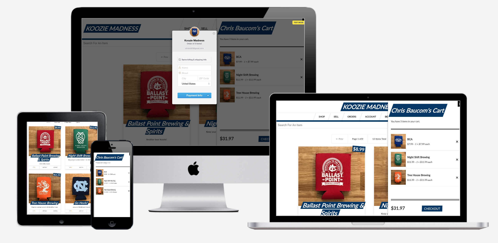

### A full-stack online store built with React, Apollo, GraphQL, Prisma, and Stripe.

### The Tech Stack

#### Frontend

- **React.js**
  - For building the interface along with:
    - **Next.js** for server side rendering, routing and tooling
    - **Styled Components** for styling
    - **React-Apollo** for interfacing with Apollo Client

* **Apollo Client**
  - For Data Management
    - Performing GraphQL **Mutations**
    - Fetching GraphQL **Queries**
    - **Caching** GraphQL Data
    - Managing **Local State**
    - **Error** and **Loading** UI States
    - Apollo Client replaces the need for redux + data fetching/caching libraries

#### Backend

- **GraphQL Yoga**
  - An Express GraphQL Server for:
    - Implementing **Query** and **Mutation Resolvers**
    - Custom **Server Side Logic**
    - **Charging** Credit Cards
    - **Sending** Email
    - Performing **JWT Authentication**
    - Checking **Permissions**
- **Prisma** - GraphQL ORM (Object Relational Mapping) - connects our Node.js backend server to any database
  - A GraphQL Database Interface
    - Provides a set of GraphQL **CRUD APIs** for MySQL or Postgres **Database**
    - **Schema** Definition
    - Data **Relationships**
    - **Queried** Directly from our Yoga Server
    - **Self-hosted** or **as-a-service**

### Features

- JWT authentication with custom permissions
- Credit card checkout via Stripe
- Easily manage items for sale
  - Create, edit, view, and remove items
  - Upload item image
  - Search items
- Password recovery via email
- Testing with Jest and Enzyme

### Future enhancements

- Update layout to look better on mobile
- Custom 404 page

Check out the source on Github - [Frontend](https://github.com/cbaucom/fullstack-react-kooziemadness-frontend) and [Backend](https://github.com/cbaucom/fullstack-react-kooziemadness-backend)

Visit the live site [here](https://kooziemadness.builtbybaucom.com)
