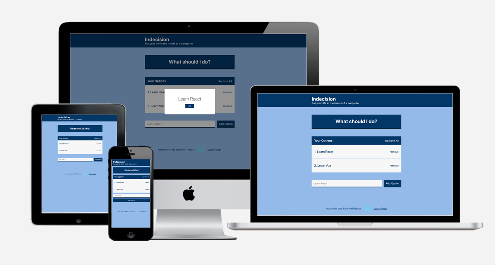

### A simple app that makes a decision for you based on given inputs

This app uses localStorage and is 100% a PWA!


### Technologies

- JavaScript - ECMAScript 6
- SASS - SCSS preprocessor
- Node modules
- React - JavaScript library

### The code

The main logic behind the decision making is actually quite simple.

On our Action button, we call `handlePick` which does the following:

```
handlePick = () => {
  const randomNum = Math.floor(Math.random() * this.state.options.length);
  const option = this.state.options[randomNum];
  this.setState(() => ({ selectedOption: option }));
};
```

To see the full source, click [here](https://github.com/cbaucom/react-indecision-app) and you can visit the live site [here](https://indecision.builtbybaucom.com)


